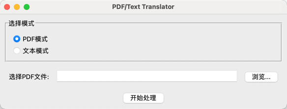
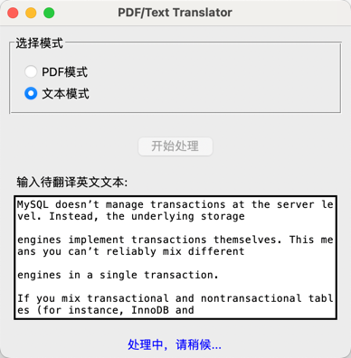
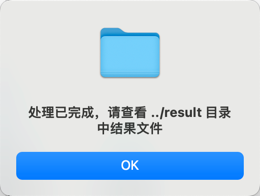
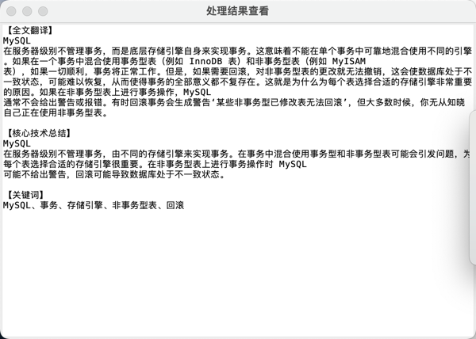

# README

## 展示

<div align="center">
  
</div>

<div align="center">
  
</div>

<div align="center">
  
</div>

<div align="center">
  
</div>

## 项目简介

本项目是一个基于大语言模型（Large Language Model, LLM）的论文阅读与翻译辅助工具。它通过用户界面（GUI）和后端处理逻辑，提供以下功能：

1. **模式选择**：
   - **PDF模式**：用户可选择一个 PDF 文件，程序自动解析论文文本及表格，对论文内容进行摘要、关键词提取及翻译。
   - **文本模式**：用户可直接输入英文文本进行摘要与关键词提取，然后翻译成中文。
2. **处理过程提示**：
   当用户发起处理请求（翻译文本或解析并翻译 PDF 文件内容）时，界面会显示“处理中”提示，避免用户等待过程中误认为程序无响应。
3. **结果展示**：
   处理完成后，不仅将结果保存到本地（JSON和文本文件），还会在新弹出的窗口中显示全文翻译、核心技术总结和关键词，方便用户快速浏览和复制。

## 功能概述

- **PDF解析**：使用 `PyMuPDF` 对 PDF 进行文本提取，并可选使用表格解析（通过 `pdfplumber`）。
- **大语言模型交互**：调用火山引擎智能语言服务（ARK runtime），根据文本内容进行摘要、关键词提取和机器翻译。
- **GUI界面**：使用 `tkinter` 构建简单易用的图形界面，用户可通过选择文件或输入文本，点击按钮一键执行。

## 技术选型

- **Python版本**：建议使用 Python 3.9+
- **后端组件**：
  - **PDF解析**：`PyMuPDF`，`pdfplumber`
  - **大语言模型 API 调用**：通过火山引擎（ByteDance）提供的 Ark runtime SDK，与 LLM（例如参考 https://www.volcengine.com/docs/82379/1399008）交互。
  - **日志记录**：`logging` 模块，用于记录处理过程和错误信息。
- **前端组件（GUI）**：
  - `tkinter`：Python内置的GUI库，用于构建基本的图形化界面。
- **数据结构与处理逻辑**：
  - 文本与PDF内容通过 `MainApp` 类进行统一管理。
  - LLM处理结果（摘要、关键词、翻译内容）通过 `Translator` 和 `LLMClient` 类获得并整合。

## 环境配置与运行步骤

1. **环境变量与API Key设置**：
   请按照[火山引擎智能语言服务文档](https://www.volcengine.com/docs/82379/1399008)进行环境变量配置（如 `API_KEY`、`API_SECRET`）。参考链接中说明可使用 `test-env.py` 来检测环境变量是否已正确设置。执行：

   ```
   python test-env.py
   ```

   若有正确输出则表明环境变量配置无误。

2. **安装依赖**：
   确保已安装必要的依赖：

   ```
   pip install PyMuPDF pdfplumber tkinter  # tkinter在部分系统中可能已内置
   pip install volcenginesdkarkruntime
   ```

   其他依赖根据 `requirements.txt` 安装。

3. **测试后端功能**：
   如需仅在终端进行简单测试，可在项目根目录执行（假设`main.py`已存在并配置正确）：

   ```
   python main.py
   ```

   这将使用内置示例文本执行 LLM 处理，并在 `../result` 目录下生成结果文件。

4. **运行 GUI**：
   在确认 `main.py` 及后端逻辑正常运行后，运行：

   ```
   python ui-translator.py
   ```

   将弹出 GUI 界面。

   - 选择模式（PDF 或 文本）
   - 若为PDF模式，则浏览选择PDF文件
   - 若为文本模式，则在文本框中粘贴英文文本
   - 点击“开始处理”

   在处理过程中，会显示“处理中...”提示。等待完成后，会有新窗口弹出展示结果，并可在 `../result` 中查看输出文件。

## 输出说明

- **日志文件**：在 `../log` 目录，以时间戳命名的日志文件记录处理过程、错误信息等。
- **结果文件**：
  - `<name>_result.json`：包含段落级摘要、关键词和中文翻译的结构化数据。
  - `<name>_translated_paper.txt`：全文中文翻译文本。
- **GUI结果窗口**：显示全文翻译、核心技术总结（提取所有段落的`summary_zh`汇总）、关键词汇总（收集所有段落的`keywords_zh`）。

## 注意事项

- LLM调用需确保网络连通性和API密钥配置正确。
- 若处理长篇PDF，可能需要等待较长时间，具体取决于网络和API响应速度。
- GUI为基础示例，可根据需要扩展更多功能，如进度条、更多模式支持、错误处理提示等。

## 联系与扩展

本项目为基础示例，可根据实际需求进行下列扩展：

- 整合更多NLP特性，如语义搜索、引文分析等。
- 优化用户界面和用户体验。
- 增加缓存与并发处理，提高处理性能。

如有问题或建议，可联系项目维护者或在Issue中讨论。

## 参考资料
- 字节跳动/火山引擎大模型 API 文档：https://www.volcengine.com/docs/82379/1399008
- PyTesseract 文档：https://pypi.org/project/pytesseract/
- PyPDF2 文档：https://pypdf2.readthedocs.io/